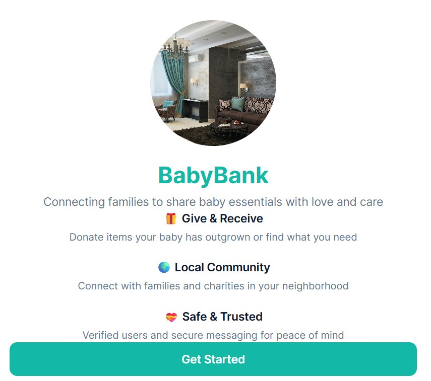
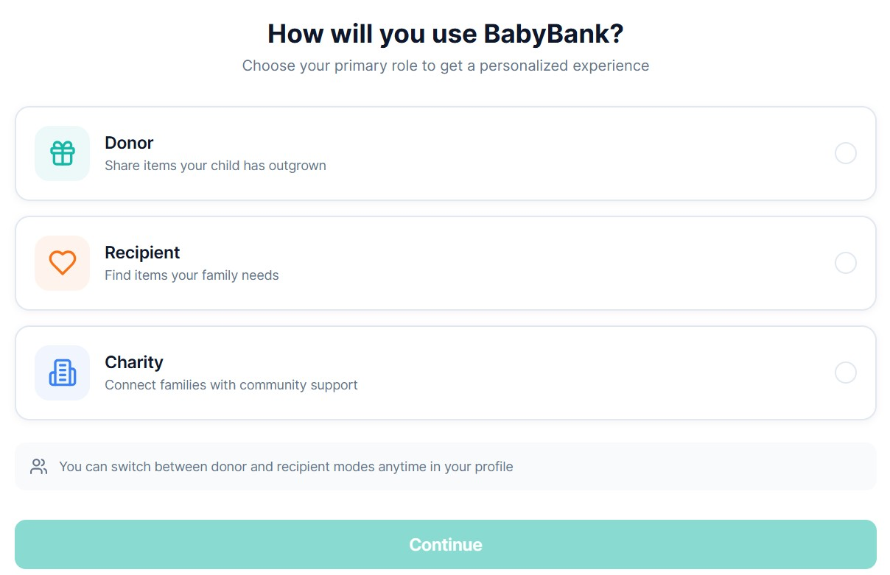

# 👶 BabyBank – Baby Item Donation App



BabyBank is a web application hosted at [ungabunga-q/BABY-BANK---BABY-ITEM-DONATION-APP](https://github.com/ungabunga-q/BABY-BANK---BABY-ITEM-DONATION-APP) that connects parents of young children with local charities and mutual aid groups to **donate or receive baby essentials** like diapers, formula, clothes, and more.

---

## 🚀 Features

✅ Register and log in as a donor or recipient  
✅ Browse available baby items by location or category  
✅ Post listings to donate baby items  
✅ Request items you need  
✅ Messaging system between donors and recipients  
✅ Admin panel for charity partners to manage donations  
✅ Mobile-friendly responsive design  

---

## 🛠️ Tech Stack

- **Frontend**: React (or your chosen JS framework)
- **Backend**: Node.js + Express
- **Database**: MongoDB / PostgreSQL (planned)
- **Hosting**: [Blot.new](https://blot.new) / Vercel / Render *(planned)*

> **Note:** Database integration and backend APIs are currently **not implemented yet** – contributions welcome!

---

## 📸 Screenshots



---

## 🏗 Project Status

🔨 **In Progress** – Basic frontend structure is set up. Database, API endpoints, and user authentication are planned but **not yet complete**.

---

## 📂 Installation

1. Clone the repo:
   ```bash
   git clone https://github.com/ungabunga-q/BABY-BANK---BABY-ITEM-DONATION-APP.git
   cd BABY-BANK---BABY-ITEM-DONATION-APP
   ```
2. Install dependencies:
   ```bash
   npm install
   ```
3. Start the development server:
   ```bash
   npm start
   ```
4. Open your browser at [http://localhost:3000](http://localhost:3000)

---

## 💡 Contributing

Pull requests are welcome! Feel free to:
- Build backend APIs
- Add database models
- Improve frontend components
- Write tests

---

## 📄 License

MIT License – see [`LICENSE`](LICENSE) for details.

---

## 🙏 Acknowledgements

Thanks to the parents, caregivers, and local charities who inspired this project. ❤️

---

## 📬 Contact

Questions? Open an [Issue on GitHub](https://github.com/ungabunga-q/BABY-BANK---BABY-ITEM-DONATION-APP/issues) or email the maintainer at [your-email@example.com].
